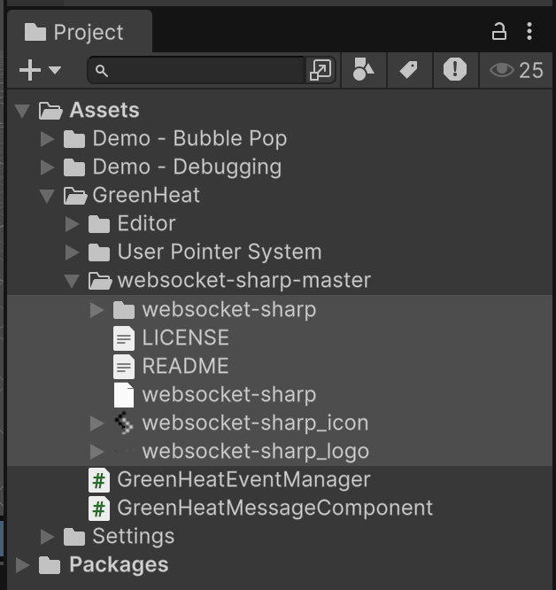

## What is this?

This is a handful of samples for using GreenHeat in Unity. This is built from [Kinsky's Work](https://github.com/kinskyunplugged/UnityGreenHeat) to support [GreenHeat](https://heat.prod.kr/tutorial) in Unity.

This project does not include instructions on configuring GreenHeat on Twitch, or using the Twitch API.

## Installation

This project requires websocket-sharp. To install:
* Open https://github.com/sta/websocket-sharp
* Press the green 'Code' button to download the zip of the repo
* Extract the files and copy it into your Unity project assets. The examples folders are optional

## Setting up a scene

The demo projects are intended to be a hands-on and easy to understand/fiddle with/tear apart. Some notes:

* The GreenHeatEventManager script listens for messages from this URL. This should be something like `wss://heat.prod.kr/yournamehere`
* The Game Mode scripts each describe some simple interactions, like spawning objects where user click
* Note how the `GreenHeatEventManager.OnGreenHeatClick += ClickEvent;` events are described in the `Start()` function. When a viewer clicks, all the data is recorded to the `ClickEvent()`
* You can drop the 'User Pointer System' prefab into a scene with a GreenHeatEventManager. It will display the positions of user's cursors with random colours

## To Do

* More samples
* More code comments
* Contribution guidelines (for now just makes tickets)

## FAQ/Troubleshooting

### Is this thread safe?

All messages are queued and handled on the main thread. There should be no issues with using Unity's normal APIs.

### Compile issues when opening the project

Likely caused by the websocket-sharp scripts not in the project. Make sure to download this repo and copy the files into the project Asset folder. After correctly copied and opened in Unity, it should look like this

### Everything is magenta?

This project was built for the Universal Render Pipeline, but that's not a requirement for the code.

### Do I need Unity 6.4?

Technically no. This code should work fine in older versions, but the project files may not open correctly.

### Anything here made by LLMs?

100% human.